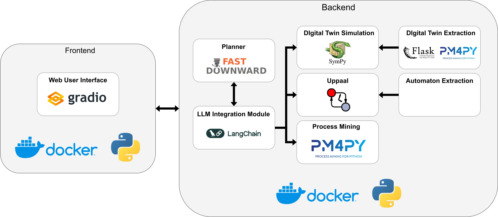
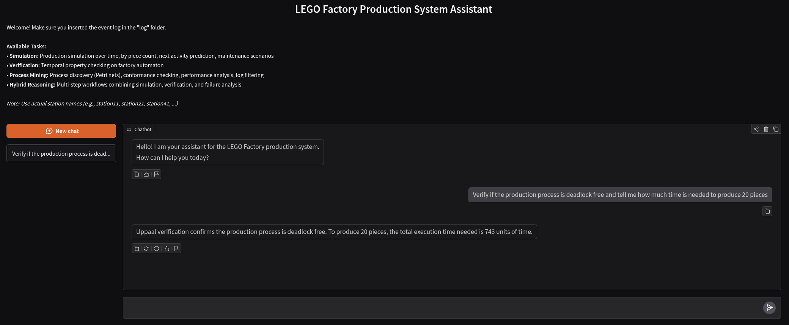

# FIDES
Source code, datasets, and instructions for the paper "[FIDES: A Neuro-Symbolic Conversational Tool for Faithful Production Process Intelligence](https://link.springer.com/chapter/10.1007/978-3-032-27997-2_22)".

## About

Modern production systems demand timely diagnostic and prognostic insights, yet the complexity of existing process intelligence (PI) tools creates a high technical barrier even for domain experts. 
This paper presents FIDES, a conversational neuro-symbolic tool designed to enable access to these analysis engines via natural language.
Unlike approaches uniquely based on Large Language Models (LLMs) that often hallucinate operational results, FIDES implements a sound routing architecture: it uses LLMs strictly for understanding and translating the user's intent into machine-readable encodings, while delegating the orchestration to a domain-independent automated planner. 
The planner autonomously decomposes complex queries and routes them to the appropriate PI engines, ensuring rigorous results. 
We demonstrate the tool's maturity and usability through a lab-scale manufacturing case study, highlighting how its web-based interface enables non-technical users to perform faithful multi-perspective analysis of production processes.

## SW Architecture

This is the software architecture behind the tool.




This screenshot reports an interaction with the GUI of the tool.

A more comprehensive video demonstration showcasing the tool in the Lego factory use case is available at: https://youtu.be/bZUNWQW07bc.

## Structure of the repository

```
.
├── images            # figures for the README file
|   └── architecture.png
├── data              # extracted automaton and simulation parameters
|   ├── automaton     # automaton files
|   |   ├── factory_automaton.json
|   |   └── event_log_250905_skg.xml
|   └── parameters    # digital twin parameters
|       ├── digital_twin_with_failure.json
|       └── digital_twin.json
├── log               # folder where to insert the event log
├── src               # source code of proposed approach
|   ├── downward      # Fast-Downward submodule code
|   ├── lsha          # LSHA automaton learning submodule (xes_extension branch)
|   ├── DTLogExtSim   # Digital twin extractor code
|   |   └── Extractor # Extractor component
|   ├── uppaal        # UPPAAL verification engine (download separately)
|   |   ├── bin/      # UPPAAL binaries (verifyta, etc.)
|   |   └── res/      # Contains Dockerfile for building image
|   ├── pddl          # PDDL files for orchestration
|   |   ├── domain.pddl    # Orchestrator PDDL domain
|   |   └── problem.pddl   # Orchestrator PDDL problem
|   ├── extractor_outputs  # outputs from the digital twin extractor
|   ├── automaton_learning.py # SKG extraction with LSHA
|   ├── chatbot.py         # GUI-based conversational interface
|   ├── docker_manager.py  # Docker container lifecycle management
|   ├── pipeline.py        # orchestration pipeline
|   ├── simulation_interface.py   # LLM-Simulation interface
|   ├── uppaal_interface.py       # UPPAAL verification interface
|   ├── pddl_interface.py         # Planning interface
|   ├── process_mining.py         # Process Mining module
|   ├── failure_interface.py      # failure handling interface
|   ├── failure_maintenance.py    # failure maintenance logic
|   ├── extractor.py              # digital twin extraction logic
|   ├── simulation.py             # simulation implementation
|   ├── prompts.json              # LLM prompts configuration
|   └── utility.py                # utility functions
├── tests
|   └── outputs       # outputs of the live convesations
├── docker-compose.yml    # Local Docker services (Chatbot, UPPAAL, Extractor)
├── Dockerfile.chatbot    # Chatbot container build
├── .env              # environment variables (API keys)
├── .gitmodules       # git submodules configuration
├── setup_submodules.sh  # automated submodule setup script
├── requirements.txt  # Python dependencies
├── LICENSE           # license information
└── README.md         # this file
```

## Getting Started

First, you need to clone the repository with its submodules:

``` bash
git clone --recurse-submodules https://github.com/angelo-casciani/FIDES
cd FIDES
```

Initialize submodules and containers within the repository by running the automated setup script:

``` bash
./setup_submodules.sh
```

This script will:
- Initialize and update git submodules (Fast Downward, LSHA);
- Build Fast Downward automatically;
- Set up LSHA for SKG (Stochastic Knowledge Graph) extraction;
- Check for Docker installation (required for Extractor and UPPAAL);
- Set up and start Docker containers (if Docker and UPPAAL license key are available).

### Python Environments

**Requires Python 3.11 or higher.**

The project uses a dual Python environment setup to manage dependency conflicts:

#### Main Environment (venv)

Create a virtual environment in the root folder of the project:

``` bash
python3 -m venv .venv
source .venv/bin/activate
```

Install the core framework dependencies:

``` bash
pip install -r requirements.txt
```

This venv is used for the main framework components: conversational layer, simulation, verification orchestration, etc.

#### LSHA Automaton Learning (conda)

LSHA (Stochastic Hybrid Automaton learning) has specific version requirements that conflict with the main framework dependencies, so it uses a separate **conda environment**.

The conda environment is automatically created by the setup script:

``` bash
./setup_submodules.sh
```

This creates an `lsha` conda environment with the exact dependencies specified in `src/lsha/environment.yml`, including `skg-connector` and other specific dependencies (e.g., TensorFlow, JAX, Neo4j).

**If conda is not installed**, install [Miniconda](https://docs.conda.io/en/latest/miniconda.html) first:

``` bash
# Verify conda is available
conda --version
```

**Why separate environments?** LSHA requires exact versions of dependencies like TensorFlow, JAX, and Neo4j that would conflict with the main framework's requirements. The conda environment provides dependency isolation, while `automaton_learning.py` automatically invokes LSHA via subprocess, so you typically won't need to manually activate the conda environment.

#### Environment Setup Verification

After running `./setup_submodules.sh`, verify both environments are ready:

``` bash
# Check main venv
source .venv/bin/activate
python --version  # Should be 3.11+

# Check LSHA conda environment
conda activate lsha
python -c "import skg_connector; print('SKG Connector:', skg_connector.__version__)"
```

Set up a [HuggingFace token](https://huggingface.co/) and/or an [OpenAI API key](https://platform.openai.com/overview) in a `.env` file in the root directory:
```env
HF_TOKEN=<your token, should start with hf_>
DEEPSEEK_API_KEY=<your key, should start with sk->
OPENAI_API_KEY=<your key, should start with sk->
GOOGLE_API_KEY=<your Gemini API key>
```

Set up a license key for [Uppaal](https://uppaal.org/) in the env variable `UPPAAL_LICENSE_KEY`. You can get one from [uppaal.veriaal.dk](https://uppaal.veriaal.dk).
This step is needed to activate the Uppaal `verifyta` used in this project.

### Docker Services

The setup script will automatically:
- Download UPPAAL 5.0.0 for Linux to `src/uppaal/`
- Build the UPPAAL Docker image with your license key
- Start Docker services (Chatbot, UPPAAL, Extractor)

If you need to manually start the services:
```bash
docker-compose up -d --build
```

This starts:
- **lego-chatbot**: Conversational GUI on http://127.0.0.1:7860
- **uppaal-engine**: Formal verification engine on port 2350
- **extractor-service**: Digital twin extractor on port 6662

## Usage

Start the conversational GUI:

``` bash
python src/chatbot.py
```

Running `chatbot.py` launches a local web application that provides a GUI for the chatbot. Once the script is launched, your terminal will provide a local link, typically something like `http://127.0.0.1:7860`. This address acts as a local server that you can access directly from your web browser.

The complete conversation will be stored in a `.txt` file in the [outputs](tests/outputs) folder.

The default parameters are:

* Gateway LLM: `'gemini-2.5-flash'`;
* Simulation LLM: `'gemini-2.5-flash'`;
* Verification LLM: `'gemini-2.5-flash'`;
* Number of generated tokens: `32768`;
* Interaction Modality: `'live'`, i.e., the live chat with the conversational framework.;
* Extracted model: `False`, i.e., the digital twin for simulation will be extracted from scratch;
* Extracted model with failure data: `False`, i.e., the digital twin for predictive maintenance will be extracted from scratch.

To customize these settings, modify the corresponding arguments when executing `chatbot.py`:

* Use `--llm_id_gateway` to specify a different Gateway LLM (e.g., among the ones reported in the *LLMs Requirements* section).
* Use `--llm_id_simulation` to specify a different Encoder LLM for Simulation (e.g., among the ones reported in the *LLMs Requirements* section).
* Use `--llm_id_verification` to specify a different Encoder LLM for Verification (e.g., among the ones reported in the *LLMs Requirements* section).
* Adjust `--max_new_tokens` to change the number of generated tokens.
* Set `--modality` to alter the interaction modality (i.e., `'live'`, `'evaluation-simulation'`, '`evaluation-verification`', `'evaluation-factory_info`', `'evaluation-process_mining`', `'evaluation-hybrid`', '`evaluation-routing`' and '`evaluation-qualitative-hybrid`').
* Use `--extracted_model` to specify if the model has already been extracted (True or False).
* Use `--extracted_model_failure` to specify if the model with failure data has already been extracted (True or False).

A comprehensive list of commands can be found in `src/cmd4tests.sh`.

## LLMs Requirements

Please note that this software leverages the open-source and proprietary LLMs reported in `src/pipeline.py`.

Request in advance the permission to use each Meta model for your HuggingFace account.
Retrive your OpenAI or Gemini API key to use the supported proprietary models.

Please note that each of the selected models have specific requirements in terms of GPU availability.
It is recommended to have access to a GPU-enabled environment meeting at least the minimum requirements for these models to run the software effectively.


## Citation

If you use this repository in your research, please cite:

```bibtex
@inproceedings{casciani2026fides,
title = {FIDES: A Neuro-Symbolic Conversational Tool for Faithful Production Process Intelligence},
author = {Casciani, Angelo and Italia, Fabrizio and Lestingi, Livia and Marinacci, Matteo and Marrella, Andrea and Matta, Andrea},
booktitle = {Intelligent Information Systems - 38th International Conference, CAiSE 2026, Verona, Italy, June 8-12, 2026, Proceedings},
series = {Lecture Notes in Business Information Processing},
volume = {587}
pages = {194--203},
doi = {https://doi.org/10.1007/978-3-032-27997-2_22},
url = {https://link.springer.com/chapter/10.1007/978-3-032-27997-2_22},
year = {2026},
publisher = {Springer}
}
```


## License

Distributed under the GNU GPL License. See [LICENSE](LICENSE) for more information.
