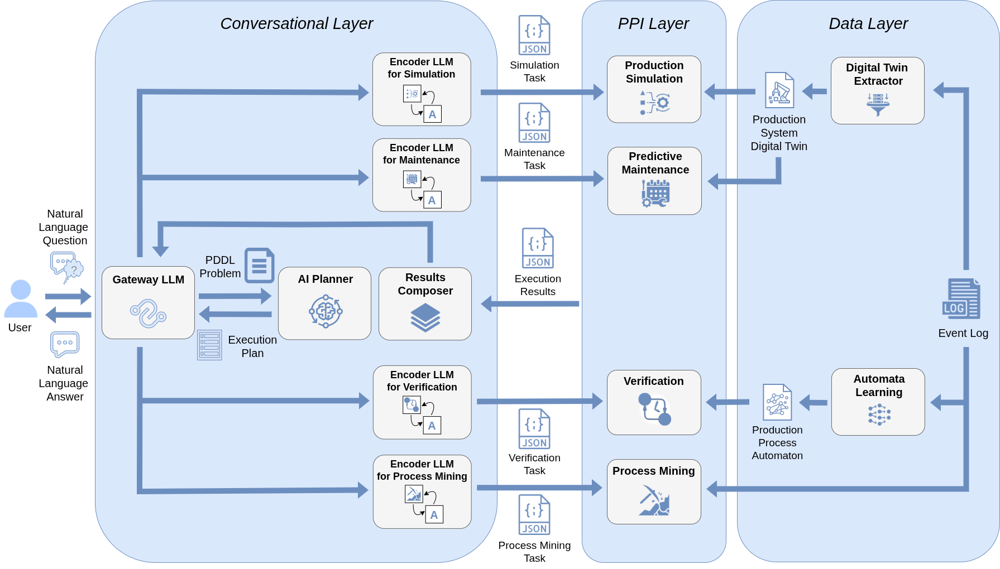

# A Conversational Framework for Faithful Multi-Perspective Analysis of Production Processes

Source code, datasets, and instructions for the paper "*A Conversational Framework for Faithful Multi-Perspective Analysis of Production Processes*".

## About

Production systems call for analysis techniques yielding reliable diagnostic and prognostic insights in a timely fashion. To this end, numerous reasoning techniques have been exploited, mainly within the simulation and formal verification realms. However, the technological barrier between these approaches and the target end users remains a stumbling block to their effective adoption. This paper presents a framework interposing a natural language based interface between the interpretation of the user’s request and the reasoning tools. The user’s natural language request is automatically translated into a machine-readable problem. The latter is then dispatched to a proper reasoning engine and either solved through a simulation or a formal verification task, thus enabling a multi-perspective analysis of the production system and certifying the correctness and transparency of the obtained solutions. The outcome is then reprocessed to be human-interpretable. State-of-the-art Large Language Models (LLMs), with their robust capability to interpret the inherent ambiguity of natural language, perform both translations. We evaluate the framework on a lab-scale case study replicating a real production system. The results of the experiments suggest that LLMs are promising complements to derive insights from faithful reasoning engines, supporting accurate analysis.

## Architecture



The Figure shows the components of the framework and how they interact.

The framework is designed to provide grounded and interpretable answers to natural language requests concerning a production process, i.e., the representation of the activities performed within a production system. It achieves this through the integration of a *Conversational Layer* and a *Reasoning Layer*. The former tackles the formulation of the problem to be fed to the Reasoning Layer and the interpretation of the results in response to the user. The latter exploits either a digital twin simulating the production process or a formal verifier reasoning on its automaton or process mining module exracting data directly from an event log. Therefore, the approach assumes the availability of an event log allowing the extraction of the simulation parameters to build the digital twin and the automaton modeling the production process. The first one is obtained through an *Extractor* that mines the needed information to build the production system's digital twin, while the second one is provided by a domain expert. Both are not LLM-generated to ensure their correctness.

As illustrated in the Figure, the Conversational Layer includes a set of LLMs: the *Gateway LLM*, which routes the user’s questions, and the *Encoder LLMs* for *Production Simulation*, *Predictive Maintenance*, *Verification* and *Process Mining*, which translate these requests into machine-readable representations compatible with the corresponding reasoners' syntax.

## Structure of the repository

```
.
├── images            # figures for the README file
|   └── architecture.png
├── data              # extracted automaton and simulation parameters
|   ├── automaton     # automaton files
|   |   ├── factory_automaton.json
|   |   └── lego_SKG_item-10_no_doubles.xml
|   └── parameters    # digital twin parameters
|       ├── digital_twin_with_failure.json
|       └── digital_twin.json
├── log               # folder where to insert the event log
├── server            # server deployment configuration
|   ├── docker-compose.server.yml  # Docker compose for server
|   ├── Dockerfile.chatbot         # Chatbot container build
|   ├── requirements.server.txt    # Lightweight API-only deps
|   └── README.md                  # Server deployment guide
├── src               # source code of proposed approach
|   ├── downward      # Fast-Downward submodule code
|   ├── DTLogExtSim   # Digital twin extractor code
|   |   └── Extractor # Extractor component
|   ├── uppaal        # UPPAAL verification engine (download separately)
|   |   ├── bin/      # UPPAAL binaries (verifyta, etc.)
|   |   └── res/      # Contains Dockerfile for building image
|   ├── pddl          # PDDL files for orchestration
|   |   ├── domain.pddl    # Orchestrator PDDL domain
|   |   └── problem.pddl   # Orchestrator PDDL problem
|   ├── extractor_outputs  # outputs from the digital twin extractor
|   ├── chatbot.py         # GUI-based conversational interface
|   ├── docker_manager.py  # Docker container lifecycle management
|   ├── main.py            # main entry point for the framework
|   ├── pipeline.py        # orchestration pipeline
|   ├── simulation_interface.py   # LLM-Simulation interface
|   ├── uppaal_interface.py       # UPPAAL verification interface
|   ├── pddl_interface.py         # Planning interface
|   ├── process_mining.py         # Process Mining module
|   ├── failure_interface.py      # failure handling interface
|   ├── failure_maintenance.py    # failure maintenance logic
|   ├── extractor.py              # digital twin extraction logic
|   ├── oracle.py                 # evaluation oracle
|   ├── rnd_bas_eval.py           # evaluation with rng and LLM-only baselines 
|   ├── simulation.py             # simulation implementation
|   ├── test_sets_generation.py   # test set generation script
|   ├── prompts.json              # LLM prompts configuration
|   └── utility.py                # utility functions
├── tests             # sources for the evaluation
|   ├── outputs       # outputs of the live convesations
|   ├── test_sets     # test sets employed during the evaluation
|   |   ├── factory_info.csv
|   |   ├── hybrid.csv
|   |   ├── process_mining.csv
|   |   ├── qualitative_hybrid_requests.txt
|   |   ├── routing.csv
|   |   ├── simulation.csv
|   |   ├── simulation_stats.txt
|   |   ├── unrelated.csv
|   |   └── verification.csv
|   └── evaluation    # quantitative evaluation results for each run
├── docker-compose.yml    # Local Docker services (UPPAAL, Extractor)
├── .env              # environment variables (API keys)
├── .gitmodules       # git submodules configuration
├── setup_submodules.sh  # automated submodule setup script
├── requirements.txt  # Python dependencies
├── LICENSE           # license information
└── README.md         # this file
```

## Getting Started

First, you need to clone the repository with its submodules:

``` bash
git clone --recurse-submodules https://github.com/angelo-casciani/conv_prod_sys
cd conv_prod_sys
```

Initialize submodules and containers within the repository by running the automated setup script:

``` bash
./setup_submodules.sh
```

This script will:
- initialize and update git submodules (Fast Downward);
- build Fast Downward automatically;
- Check for Docker installation (required for Extractor and UPPAAL);
- Set up and start Docker containers (if Docker and UPPAAL license key are available).

### Python Environment

**Requires Python 3.11 or higher.**

Create a virtual environment in the root folder of the project:

``` bash
python3 -m venv .venv
source .venv/bin/activate
```

Run the following command to install the necessary packages along with their dependencies in the `requirements.txt` file using `pip`:

``` bash
pip install -r requirements.txt
```

Set up a [HuggingFace token](https://huggingface.co/) and/or an [OpenAI API key](https://platform.openai.com/overview) in a `.env` file in the root directory:
```env
HF_TOKEN=<your token, should start with hf_>
DEEPSEEK_API_KEY=<your key, should start with sk->
OPENAI_API_KEY=<your key, should start with sk->
GOOGLE_API_KEY=<your Gemini API key>
```

Set up a license key for [Uppaal](https://uppaal.org/) in the env variable `UPPAAL_LICENSE_KEY`. You can get one from [uppaal.veriaal.dk](https://uppaal.veriaal.dk).
This step is needed to activate the Uppaal `verifyta` used in this project.

### Docker Services

The setup script will automatically:
- Download UPPAAL 5.0.0 for Linux to `src/uppaal/`
- Build the UPPAAL Docker image with your license key
- Start Docker services (UPPAAL and Extractor)

If you need to manually start the services:
```bash
docker-compose up -d
```

This starts:
- **uppaal-engine**: Formal verification engine on port 2350
- **extractor-service**: Digital twin extractor on port 6662

### Server Deployment

For deploying on a remote server with Docker, see [server/README.md](server/README.md).

## Usage

Start the conversational framework and interact with it through CLI:

``` bash
python src/main.py
```

or for the GUI version:

``` bash
python src/chatbot.py
```

Running `chatbot.py` launches a local web application that provides a GUI for the chatbot. Once the script is launched, your terminal will provide a local link, typically something like `http://127.0.0.1:7860`. This address acts as a local server that you can access directly from your web browser.

The complete conversation will be stored in a `.txt` file in the [outputs](tests/outputs) folder.

The default parameters are:

* Gateway LLM: `'gpt-4o-mini'`;
* Simulation LLM: `'gpt-4o-mini'`;
* Verification LLM: `'gpt-4o-mini'`;
* Number of generated tokens: `512`;
* Interaction Modality: `'live'`, i.e., the live chat with the conversational framework.;
* Extracted model: `False`, i.e., the digital twin for simulation will be extracted from scratch;
* Extracted model with failure data: `False`, i.e., the digital twin for predictive maintenance will be extracted from scratch.

To customize these settings, modify the corresponding arguments when executing `main.py`:

* Use `--llm_id_gateway` to specify a different Gateway LLM (e.g., among the ones reported in the *LLMs Requirements* section).
* Use `--llm_id_simulation` to specify a different Encoder LLM for Simulation (e.g., among the ones reported in the *LLMs Requirements* section).
* Use `--llm_id_verification` to specify a different Encoder LLM for Verification (e.g., among the ones reported in the *LLMs Requirements* section).
* Adjust `--max_new_tokens` to change the number of generated tokens.
* Set `--modality` to alter the interaction modality (i.e., `'live'`, `'evaluation-simulation'`, '`evaluation-verification`', `'evaluation-factory_info`', `'evaluation-process_mining`', `'evaluation-hybrid`', '`evaluation-routing`' and '`evaluation-qualitative-hybrid`').
* Use `--extracted_model` to specify if the model has already been extracted (True or False).
* Use `--extracted_model_failure` to specify if the model with failure data has already been extracted (True or False).

A comprehensive list of commands can be found in `src/cmd4tests.sh`.

## LLMs Requirements

Please note that this software leverages the open-source and closed-source LLMs reported in the table:

| Model | HuggingFace Link |
| ----- | ---------------- |
| meta-llama/Meta-Llama-3-8B-Instruct | [HF link](https://huggingface.co/meta-llama/Meta-Llama-3-8B-Instruct) |
| meta-llama/Meta-Llama-3.1-8B-Instruct | [HF link](https://huggingface.co/meta-llama/Meta-Llama-3.1-8B-Instruct) |
| meta-llama/Llama-3.2-1B-Instruct | [HF Link](https://huggingface.co/meta-llama/Llama-3.2-1B-Instruct) |
| meta-llama/Llama-3.2-3B-Instruct | [HF link](https://huggingface.co/meta-llama/Llama-3.2-3B-Instruct) |
| mistralai/Mistral-7B-Instruct-v0.2 | [HF link](https://huggingface.co/mistralai/Mistral-7B-Instruct-v0.2) |
| mistralai/Mistral-7B-Instruct-v0.3 | [HF link](https://huggingface.co/mistralai/Mistral-7B-Instruct-v0.3) |
| mistralai/Mistral-Nemo-Instruct-2407 | [HF link](https://huggingface.co/mistralai/Mistral-Nemo-Instruct-2407) |
| mistralai/Ministral-8B-Instruct-2410 | [HF link](https://huggingface.co/mistralai/Ministral-8B-Instruct-2410) |
| Qwen/Qwen2.5-7B-Instruct | [HF link](https://huggingface.co/Qwen/Qwen2.5-7B-Instruct) |
| google/gemma-2-9b-it | [HF link](https://huggingface.co/google/gemma-2-9b-it) |
| microsoft/phi-4 | [HF link](https://huggingface.co/microsoft/phi-4) |
| gpt-4o-mini | [OpenAI link](https://platform.openai.com/docs/models) |
| deepseek-ai/DeepSeek-R1-Distill-Qwen-7B | [HF link](https://huggingface.co/deepseek-ai/DeepSeek-R1-Distill-Qwen-7B) |
| deepseek-ai/DeepSeek-R1-Distill-Llama-8B | [HF link](https://huggingface.co/deepseek-ai/DeepSeek-R1-Distill-Llama-8B) |

Request in advance the permission to use each Llama model for your HuggingFace account.
Retrive your OpenAI API key to use the supported GPT model.

Please note that each of the selected models have specific requirements in terms of GPU availability.
It is recommended to have access to a GPU-enabled environment meeting at least the minimum requirements for these models to run the software effectively.


## Experiments

### Simulation experiments

To reproduce the experiments for the *simulation* evaluation, for example:

``` bash
python src/main.py --llm_id_simulation Qwen/Qwen2.5-7B-Instruct --modality evaluation-simulation --max_new_tokens 512
```

The results will be stored in a `.txt` file reporting all the information for the run and the corresponding results in the [evaluation](tests/evaluation) folder.

### Verification experiments

To reproduce the experiments for the *verification* evaluation, for example:

``` bash
python src/main.py --llm_id_verification gpt-4o-mini --modality evaluation-verification --max_new_tokens 512
```

The results will be stored in a `.txt` file reporting all the information for the run and the corresponding results in the [evaluation](tests/evaluation) folder.

### Factory info experiments

To reproduce the experiments for the *factory\_info* evaluation, for example:

``` bash
python src/main.py --llm_id_gateway gemini-2.0-flash --modality evaluation-factory_info --max_new_tokens 512
```

The results will be stored in a `.txt` file reporting all the information for the run and the corresponding results in the [evaluation](tests/evaluation) folder.

### Process mining experiments

To reproduce the experiments for the *process\_mining* evaluation, for example:

``` bash
python src/main.py --llm_id_gateway mistralai/Mistral-Nemo-Instruct-2407 --modality evaluation-process_mining --max_new_tokens 512
```

The results will be stored in a `.txt` file reporting all the information for the run and the corresponding results in the [evaluation](tests/evaluation) folder.

### Hybrid experiments

To reproduce the experiments for the *hybrid* evaluation, for example:

``` bash
python src/main.py --llm_id_gateway deepseek-ai/DeepSeek-R1-Distill-Qwen-7B --modality evaluation-hybrid --max_new_tokens 512
```

The results will be stored in a `.txt` file reporting all the information for the run and the corresponding results in the [evaluation](tests/evaluation) folder.

### Routing experiments

To reproduce the experiments for the *routing* evaluation, for example:

``` bash
python src/main.py --llm_id_gateway mistralai/Mistral-7B-Instruct-v0.3 --modality evaluation-routing --max_new_tokens 512
```

The results will be stored in a `.txt` file reporting all the information for the run and the corresponding results in the [evaluation](tests/evaluation) folder.

### Qualitative Hybrid experiments

To reproduce the experiments for the *hybrid* qualitative evaluation, for example:

``` bash
python src/main.py --llm_id_gateway deepseek-ai/DeepSeek-R1-Distill-Qwen-7B --modality evaluation-qualitative-hybrid --max_new_tokens 512
```

The results will be stored in a `.txt` file reporting all the information for the run and the corresponding results in the [evaluation](tests/evaluation) folder.

### RNG and LLM-Only Baselines experiments
We provide baseline comparisons for the simulation and verification tasks using `answers-dataset.csv`to motivate our approach, which leverages PPI tools in the backend to produce faithful answers.

``` bash
python src/rnd_bas_eval.py
```

The random baseline samples answers uniformly between the minimum and maximum values in the ground-truth dataset for simulation, and samples a boolean value uniformly for verification. The LLM baseline uses only the event log (in the [log](log) folder) as input. By default, it uses the `gemini-2.5-flash` model (requiring a Google API key), but you can change the model inside the script.

### Generation of New Test Sets

To generate new test sets for the three supported evaluation, run the script `test_sets_generation.py` before running an evaluation.

``` bash
python src/test_sets_generation.py
```

## License

Distributed under the GNU GPL License. See [LICENSE](LICENSE) for more information.